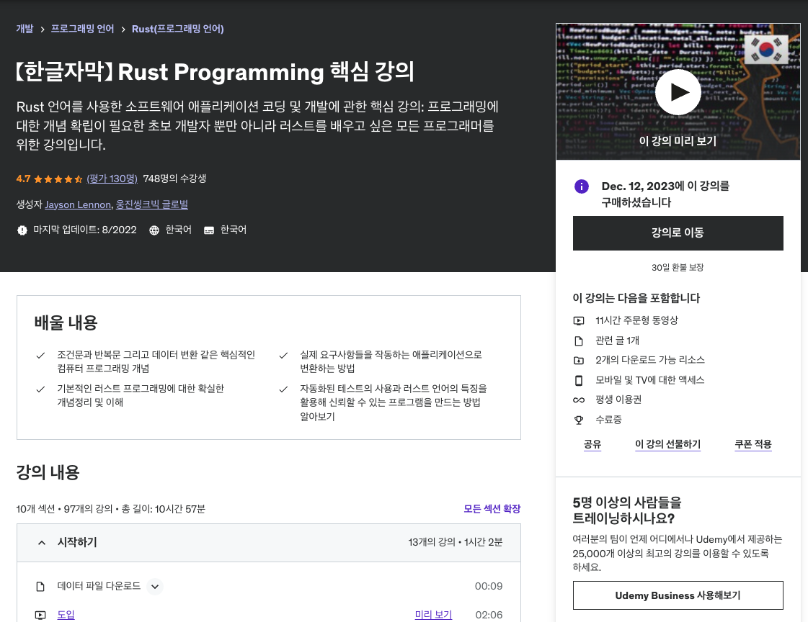

## 0. 강의소개

총 10개의 섹션, 97개의 강의, 총 길이 10시간 57분을 가지고 있는 Rust Programming 강의 입니다. 핵심 강의라고는 하지만 러스트 기초 문법에 대한 강의이므로 러스트 초급 강의라고 생각하시면 좋을 것 같습니다.

이 강의에서 배울 내용은

1. 조건문과 반복문, 데이터 변환과 같은 프로그래밍 개념
2. 세부사항에 지나치게 치우지지 않는 코드 작업에 필요한 중요한 개념
3. 컴퓨터 메모리, 프로그램 로직, 간단한 데이터 구조 같은 기본적인 컴퓨터 과학 개념
4. 요구사항들을 작동하는 애플리케이션으로 작성하는 방법
5. 기본 러스트 프로그래밍에 대한 개념정리 및 이해
6. 효율적으로 애플리케이션을 개발하기 위해 Rust 에코시스템 활용 방법
7. 자동화된 테스트 사용과 러스트 언어의 특징을 활용해 신뢰할 수 있는 프로그램을 만드는 방법

입니다.

강의 뿐만 아니라 직접 코딩을 해 볼 수 있는 30여개의 코드 예제 및 요구사항이 있기 때문에 강의만 들을 수도 있고, 직접 경험해 볼 수도 있습니다.

## 1. 이 강의를 선택한 이유

글또에서 Udemy강의를 듣고 후기를 작성할 수 있는 기회가 생겼습니다. 이전부터 새로운 언어를 배우고 싶다 생각했었고, 그 언어는 Rust였기 때문에 이 기회를 틈타 러스트를 학습하기로 했습니다.

그래서 러스트 관련 강의를 보던 중 가장 기초적인 내용을 쉽게 학습할 수 있고 괜찮아 보이던 강의를 찾던 중 이 **Rust Programming 핵심 강의**를 찾게 되었습니다.

이 강의를 선택한 가장 큰 이유는

1. 강의만 듣고 끝나는게 아니라 실습을 통해 문법을 익힐 수 있으면 좋겠다.
2. 단순 문법만으로 끝나는게 아니라 이걸 기반으로 무엇을 만들 수 있으면 좋겠다.
3. 개별 강의의 길이가 짧았으면 좋겠다.

이 세가지를 충족했었기 때문입니다.

## 2. Rust Programming 핵심 강의 후기

- 강의 하나의 길이가 짧습니다. 2분 ~ 10분 사이의 강의로 들을 수 있어서 좋았습니다.
- 실습 파일이 존재하고, 실습을 진행하고 강의자가 작성한 코드를 확인할 수 있어서 좋았습니다.
- 문법 위주로 강의하다 보니 약간 지루한 감은 있었습니다.
  - 특정 언어를 처음 학습할 때에는 어느정도 견뎌내야 하지 않을까 하고 참아가며 공부했습니다.
- 초급자용 강의이기에 강의가 쉽습니다.
  - 그래서 개발에 익숙하지 않은 분들도 문제없이 학습 가능할 것이라 생각됩니다.

## 3. 학습한 내용

1. 러스트는 컴파일 할 때 타입을 체크하며 자바스크립트보다 엄격하게 컴파일 단계에서 확인합니다.

   - 저는 프론트 개발자라서 컴파일이 엄격한 코드를 학습할 수 있어 좋았습니다.
   - Enum의 사용이 확실히 javscript와 다르다고 느꼈습니다. enum 자체가 enum type을 가지고 있어서 특정 상수와 동등한 비교를 하지 못한다는 사실이 javascript의 enum과 확실히 달라 신기했습니다.

2. 소유권 개념이 신기했습니다.

   - 자바스크립트는 개발자가 메모리 관리 같은것을 신경쓰지 않아도 되는데, 러스트는 소유권 개념을 들고와서 gc를 컨트롤 할 수 있었습니다.
   - 자바스크립트에서는 gc를 개발자가 관리하지 않아도 됩니다. 그러나 잘못 사용되는 경우 gc가 해제가 되지 않는 등 이슈가 발생할 수 있는데, rust에서는 이와 관련된 내용을 **소유권** 이라는 개념 기반으로 풀어나가는 걸 학습할 수 있었습니다.

3. match 연산자

   - switch와 유사하게 동작하는데, 개발자가 놓칠 수 있는 예외 케이스를 컴파일 단계에서 확인 해 준다는 점이 인상 깊었습니다. 확실히 컴파일 단계에서 잡아주는게 많다보니 더 안정적인 코드 작성이 가능할 것이라고 생각했습니다.

4. 이외

   - 러스트의 문법과 디버그, 라이브러리 및 모듈화등에 대해 학습할 수 있었습니다. 더 많은 내용은 Rust Programming 핵심 강의를 통해 학습 해 보시면 좋을 것 같습니다.

## 4. 강의 추천 대상

- 코딩 방법을 배우고 싶은 코딩 초보 개발자 및 취업준비생
- 로우 레벨 언어를 습득하고 싶은 개발자
- 러스트 프로그래밍 기술에 관심이 있으신 분
- 초급 강의이기 떄문에 러스트를 어느정도 알고 싶은 사람은 추천하지 않습니다.

---

**해당 포스트는 글또 9기를 통해 Udemy 강의 쿠폰을 제공받아 작성하였습니다.**

