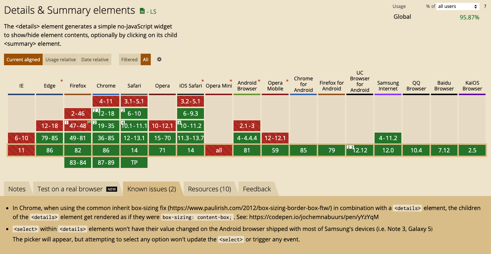

## Acordian Component


아코디언 UI라고 하면 생소할 수 있으나, 보면 "아! 이거!" 라고 말할 수 있는 UI 컴포넌트입니다. 이걸 만들기 위해서 `html, css, js` 를 활용하여 만들었는데요, 이를 지원하는 `HTML` 태그가 있다고 합니다. 

그 태그는 바로, `details` 태그와 `summary` 태그입니다.

### details and summary

HTML 태그답게 정말 간단하게 사용 할 수 있습니다.

<details>
    <summary>
        Click!
    </summary>
    <p> 짜잔 ! 아코디언 UI 완성</p>
</details>

```html
<!-- HTML-->
<details>
    <summary>
        Clike!
    </summary>
    <p>짜잔, 아코디언 UI 완성 !</p>
</details>
```

정말 간단하게 만들 수 있습니다!



<a href="https://caniuse.com/?search=detail" target="_blank">can i use</a> 에서 확인해 보면, IE에는 지원이 안되고, Chrome및 firefox, edge에서는 지원이 되네요..!

#### details

이 `details`에 대해 더 알아보기 위해 <a href="https://www.w3schools.com/tags/tag_details.asp" target="_blank">w3schools</a> 에서 어떤 attribute 들이 사용되는지 확인하였고, `<details>` 또한 global attibutes를 지원하는 것으로 나왔습니다.

##### Change Widget

이 detail 태그를 사용하다 보니, `carrot`&#9654;이 조금 거슬리는데요, 이 carrot을 수정하는 방법을 검색 해 봤습니다. 우리의 좋은 친구 <a href="https://stackoverflow.com/questions/6195329/how-can-you-hide-the-arrow-that-is-displayed-by-default-on-the-html5-details-e" target="_blank">stackoverflow</a>를 활용해서요.

```css
details > summary {
  list-style: none;
}

details > summary::-webkit-details-marker {
  display: none;
}
```

details 요소의 표준화 과정 중 추가된 실험적 구현이기 때문에 브라우저의 지원에 차이가 있으므로, 당분간 여러 방식을 함께 사용해야 합니다.

##### attribute

`open` : 상세 정보, details 요소의 컨텐츠가 보이는 상태인지 나타냅니다. 기본값은 `false`를 가집니다.

##### Event Handling

`<details></details>`는 상태가 열기, 닫기로 바뀔 때 `toggle` 이벤트가 발생하며, 이를 활용하여 작업을 진행 할 수도 있습니다.

```js
details.addEventListener('toggle', e => {
    if (details.open) {

    } else {

    }
})
```

#### summary

`summary`태그는 `<details>` 태그의 heading 역할을 담당하고 있습니다. 이 summary를 누르면, 디테일한 정보를 보여주고 숨길 수 있으며, `<summary>`태그는 `<details>` 엘리먼트에 첫번째 자식이 되어야 합니다.

<a href="https://www.w3schools.com/tags/tag_summary.asp" target="_blank">w3school-summary</a> 에서도 자세한 정보를 알아 볼 수 있습니다.

#### +

`details` 엘리먼트의 attribute를 찾아보다가, `accesskey`라는 전역 element property에 대해 알게 되었습니다.

<a 
    href="https://www.w3schools.com/tags/att_global_accesskey.asp"
    accesskey="k"
    target="_blank">HTML accesskey attribute
</a>

여기서 맥북 유저라면 `[Control] + [Option] + k`를, 그외 os를 사용(windows, linux) 하시면 `[ALT] + K` 를 눌러보세요.

```html
<a 
    href="https://www.w3schools.com/tags/att_global_accesskey.asp"
    accesskey="k"
    target="_blank">HTML accesskey attribute
</a>
```

이런식으로 되어 있는데, accesskey를 활용하여 단축키처럼 활용할 수 있다는 사실을 알게 되었습니다..!

이는, [mdn-accesskey](https://developer.mozilla.org/ko/docs/Web/HTML/Global_attributes/accesskey)를 보시면 더 자세한 설명이 나오는데요, 접근성 및 국제화 문제등에 의해 사용하지 않는 것을 **권장** 한다고 합니다.
