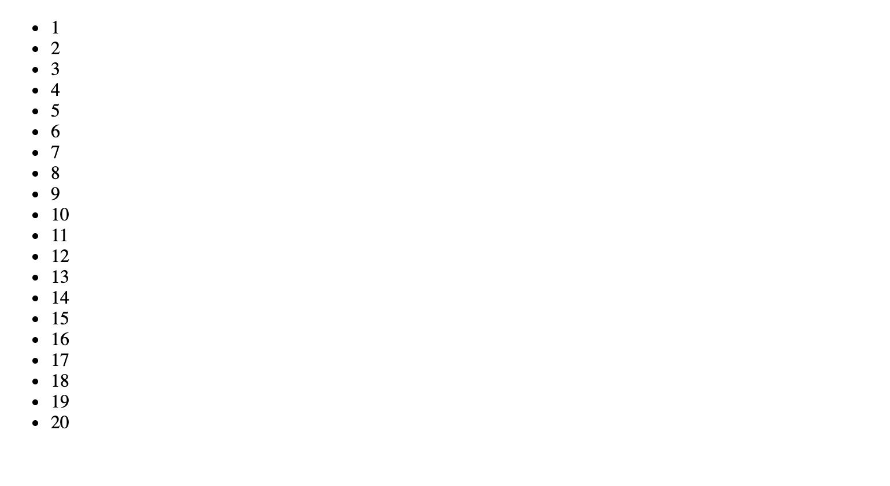
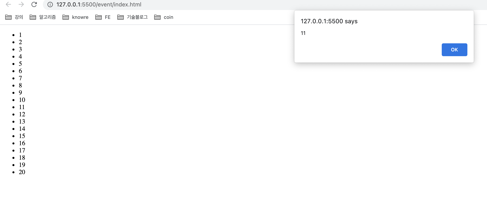
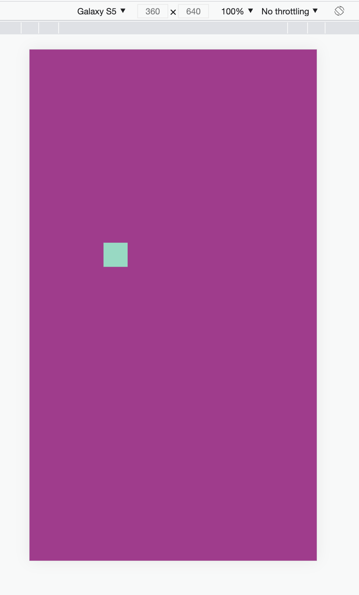
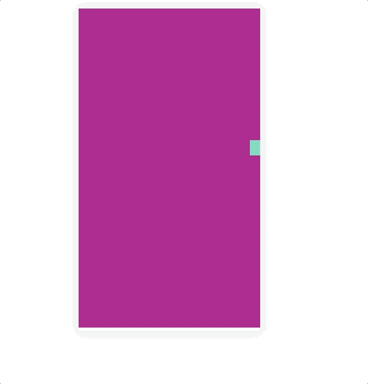
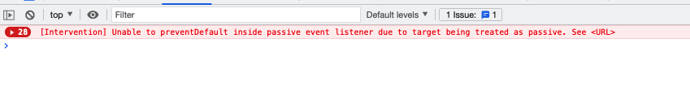

## 1. 왜 알아보는가 ?

회사에서 `mousedown, mousemove, mouseup` 으로 인터렉션을 하는 컴포넌트를 개발했습니다. 제가 담당하고 있는 프로젝트 특성상 만들어진 컴포넌트가 웹뷰를 통해 태블릿으로 보여지고, 동작하게 되어야 합니다. 그래서 touch와 관련된 이벤트를 추가했습니다.

**addEventListener** 로 이벤트를 추가하는 것은 어려운 일이 아닙니다. 콜백으로 사용하는 함수의 경우 기존 mouse event에서 콜백으로 사용하는 함수를 사용하면 되기에 별 문제가 없을 것이라 생각했습니다.

그러나 터치 이벤트는 사용하는 기기가 바뀌기 때문에 고려해야 할 사항들이 꽤 있었습니다. 제가 직면한 문제는 다음과 같습니다.

1. 컴퓨터의 경우 인터렉션을 위해 마우스를 사용하지만, 태블릿의 경우 터치를 위해 애플 펜슬과 같은 터치를 도와주는 기구를 쓰지 않을수도 있습니다. 이경우 가장 터치하는데 많이 사용하는 도구인, **손가락** 을 기준으로 터치 영역을 잡았어야 했습니다. 그러나 마우스를 기반으로 사용하는 것 만큼의 터치 영역을 잡았기에, 실제 손가락으로 인터렉션을 일으키는게 어려웠었고 이는 간단하게 해결했습니다.

2. 터치 이벤트를 추가 했을 때, touchmove가 발생할 때 스크롤도 엄청나게 발생했습니다. 쿵쾅쿵쾅 거리는 화면을 보면서 무언가 잘못됨을 느끼고 일단 막아보자 생각하고 **preventDefault** 를 설정했습니다.

3. **preventDefault**를 설정하니 브라우저에서 경고를 합니다. `passive` 와 관련된 설정을 하라고 나오는데 이는 왜 나오는거고, passive는 어떤 일을 하는걸까 라는 궁금증이 생겼습니다.

그래서 알아보도록 하면서 같이 이것 저것 알아보려고 합니다.

## 2. 이벤트의 흐름

stackoverflow에 있는 글인 [What is event bubbling and capturing?](https://stackoverflow.com/questions/4616694/what-is-event-bubbling-and-capturing) 에서 좋은 자료와 이미지를 찾았습니다.


### 2.1 Event의 Phase

Dom event는 총 4가지의 실행 단계를 가지고 있습니다.

1. event.NONE
   이벤트 발생시 **event** 인자를 사용하여 **NONE**에 접근하면 0의 값을 가집니다. 아무런 이벤트도 발생하지 않았음을 의미합니다.

2. event.CAPTURING_PHASE
   1의 값을 가지며, 이벤트가 상위 개체를 통해 전파됩니다. **Window, Document**에서 시작하여 DOM 트리를 따라 대상의 부모에 도달할 때 까지 요소들을 통과 합니다. 이 단계에서 **addEventListener**가 호출될 때 캡처 모드에 있는 이벤트리스너가 트리거 됩니다.

3. event.AT_RANGE
   2의 값을 가지며, event가 **eventTarget**에 도착합니다. 이 단계에서 등록된 이벤트 리스너가 호출됩니다. 만약 Event.bubbles이 false라면 이 단계가 오나료된 다음 이벤트 진행은 종료 됩니다.

4. event.BUBBLING_PHASE
   3의 값을 가집니다. 이벤트가 역순으로 조상을 통해 전파 됩니다. 부모로부터 시작해, **Window** 를 포함하는 단계까지 도달합니다. Event.bubbles가 **true** 때만 발생합니다.

설명만 봐서는 자세히 이해가 되지 않기에 간단한 실습을 진행 해 봤습니다.

### 2.2 이벤트 버블링

한 요소에 이벤트가 발생하면, 이 요소에 할당된 핸들러가 동작하고, 이어서 부모 요소의 핸들러가 동작합니다. 가장 최상단의 조상 요소를 만날 때까지 이 과정이 반복되면서 요소 각각에 할당된 핸들러가 동작합니다.

```html
<div id="d1">
  첫번째 이벤트
  <div id="d2">
    두번째 이벤트
    <div id="d3">
      세번째 이벤트
    </div>
  </div>
</div>
<script>
  const getDomById = id => document.getElementById(id)
  const d1 = getDomById("d1")
  const d2 = getDomById("d2")
  const d3 = getDomById("d3")
  d1.addEventListener("click", e => console.log("d1 called", e.target.id))
  d2.addEventListener("click", e => console.log("d2 called", e.target.id))
  d3.addEventListener("click", e => console.log("d3 called", e.target.id))
</script>
```

위와 같은 코드를 작성하고 실행을 해보면,

d3 => d2 => d1 순으로 호출이 됩니다. 자바스크립트의 이벤트들은 대부분 버블링되며 캡처링 되는 일은 거의 없습니다. 또한, 현대 브라우저들은 기본적으로 모든 이벤트들을 버블링 하게 끔 구현 되어 있습니다.

### 2.3 이벤트 캡처링

이벤트 버블링과 반대로 동작하는 과정입니다.

> 기본적으로 모든 이벤트 핸들러는 버블링 단계에 등록되어 있고, 이것은 대부분의 경우 더 타당합니다. 만약 정말로 이벤트를 캡처링 단계에 대신 등록하기를 원한다면 **addEventListener(eventType, callback, {capute: true})** 에서 보듯이, 세번째 인자에 **capture: true**로 두면 됩니다.

```html
<div id="d1">
  첫번째 이벤트
  <div id="d2">
    두번째 이벤트
    <div id="d3">
      세번째 이벤트
    </div>
  </div>
</div>
<script>
  const getDomById = id => document.getElementById(id)
  const d1 = getDomById("d1")
  const d2 = getDomById("d2")
  const d3 = getDomById("d3")
  d1.addEventListener("click", e => console.log("d1 called", e.target.id, e), {
    capture: true,
  })
  d2.addEventListener("click", e => console.log("d2 called", e.target.id, e), {
    capture: true,
  })
  d3.addEventListener("click", e => console.log("d3 called", e.target.id, e))
</script>
```

이경우 d1 => d2 => d3 순으로 나타나게 됩니다.

여기서 재미있는 것을 발견했습니다. **d3** 만 **capute: true** 일 경우 이벤트 캡처링이 일어나지 않습니다. 그 이유는 **d3**의 부모 들이 버블링 단계를 따르기 때문입니다. 그렇기에 capture를 사용할 경우 DOM TREE내에서 캡처링할 부모와 자식의 관계를 잘 살펴보고 옵션을 넣어줘야 할 것 같습니다.

> 버블링과 캡처링, 두 타입의 이벤트 핸들러가 모두 존재하는 경우에, 캡처링 단계가 먼저 실행되고, 이어서 버블링 단계가 실행됩니다.

그렇다면 캡처링은 왜 나타난 걸까요?

MDN의 [이벤트 입문](https://developer.mozilla.org/ko/docs/Learn/JavaScript/Building_blocks/Events) 을 보면 다음과 같습니다.

> 브라우저들이 지금보다 훨씬 덜 호환되던 옛날의 좋지 못하던 시절에  
> **Netscape**는 오직 **이벤트 캡처링**만을 사용했고,  
> **Internet Explorer**는 오직 **이벤트 버블링**만을 사용했습니다.  
> W3C가 이 움직임을 표준화하고 합의에 이르기를 시도하기로 결정했을 때, 그들은 양 쪽을 다 포함하는 이 시스템을 채용하게 되었는데, 이것이 현대 브라우저들이 구현한 것입니다.

### 2.4 이벤트 위임

이런 브라우저의 구조 때문에 우리는 버블링을 겪게 되고, 이를 피하고 싶을 경우도 생길 것 입니다. 이 때 **event.stopPropagation()** 을 사용함으로써 이벤트의 전파를 막을 수 있습니다.

이벤트 버블링은 유용하게 쓰일수도 있습니다. **이벤트 위임** 이라는 기법을 쓸 수 있기 때문입니다.

이벤트 위임이란, 다수의 자식 요소 중 하나를 선택했을 때 같은 이벤트 함수를 호출하길 원하면 자식 요소에 이벤트를 다 걸어주는게 아닌, 부모에 설정하고 자식에게서 일어난 이벤트가 부모에게 올라오게 하여 효율적으로 코드를 작성할 수 있게 합니다.

```html
<ul id="uls">
  <li class="lis">1</li>
  <li class="lis">2</li>
  <li class="lis">3</li>
  <li class="lis">4</li>
  <li class="lis">5</li>
  <li class="lis">6</li>
  <li class="lis">7</li>
  <li class="lis">8</li>
  <li class="lis">9</li>
  <li class="lis">10</li>
  <li class="lis">11</li>
  <li class="lis">12</li>
  <li class="lis">13</li>
  <li class="lis">14</li>
  <li class="lis">15</li>
  <li class="lis">16</li>
  <li class="lis">17</li>
  <li class="lis">18</li>
  <li class="lis">19</li>
  <li class="lis">20</li>
</ul>
<script>
  document
    .getElementById("uls")
    .addEventListener("click", e => alert(e.target.textContent))
</script>
```

위 예시 코드의 경우 아래 사진 처럼 나타나게 됩니다.



여기서 저 숫자를 누르게 되면, 해당 숫자를 alert하게 됩니다.



### 2.5 이벤트 전파 막기

캡처링의 경우 개발자가 직접 옵션을 줘야 합니다. 그렇기에 캡처링에 이벤트 전파를 막을 일은 거의 없을 것입니다.  
그러나 이벤트 버블링의 경우 개발자가 의도하든, 의도하지 않든 적용되기 때문에, 이를 막기 위한 함수가 있습니다.  
이벤트 객체`event` 에 구현된 `event.stopPropagation` 을 이용해서 이벤트의 전파를 막을수도 있습니다. 그러나 이 `stopPropagation`의 경우 상위 부모에게만 전파를 막기 떄문에, 모든 전파를 막기 위해서 `event.stopImmediatePropagation()` 을 사용할 수도 잇습니다.

## 3. 브라우저 기본 동작

상당수 이벤트는 발생 즉시 브라우저에 의해 특정 동작을 자동으로 수행합니다.

### 3.1 브라우저 기본 동작 막기

브라우저 기본 동작을 막는 방법은 두가지가 있습니다.

- event 객체를 사용해서, **event**객체에 구현된 **event.preventDefault()** 를 사용합니다.
- 핸들러가 **addEventListener**가 아닌 **onEvent** 를 사용한 경우 false를 반환해 기본 동작을 막을 수 있습니다.

### 3.2 passive

addEventListener의 세번째 인자로 객체를 넣을 경우, **passive**라는 옵션을 넣을 수 있습니다. passive가 **true** 를 가지게 되면, 브라우저에게 **preventDefault()**를 호출하지 않겠다고 알립니다.

저는 여기서 이슈가 있었는데요, 제가 겪었던 이슈와 비슷한 예제를 만들었습니다.

```html
<!DOCTYPE html>
<html lang="en">
  <head>
    <meta charset="UTF-8" />
    <meta http-equiv="X-UA-Compatible" content="IE=edge" />
    <meta name="viewport" content="width=device-width, initial-scale=1.0" />
    <title>Document</title>
    <style>
      * {
        margin: 0;
        padding: 0;
      }
      #app {
        width: 100vw;
        height: 100vh;
        background-color: rgb(173, 47, 144);
      }

      #move {
        width: 30px;
        height: 30px;
        left: 30px;
        top: 30px;
        position: absolute;
        background-color: rgb(132, 219, 194);
      }
    </style>
  </head>
  <body>
    <div id="app">
      <div id="move"></div>
    </div>
    <script>
      const move = document.getElementById("move")
      let startCoord = null
      const touchmove = e => {
        if (e.changedTouches.length === 1) {
          const touches = e.changedTouches[0]
          const coord = {
            x: touches.clientX - startCoord.x,
            y: touches.clientY - startCoord.y,
          }
          move.style.left = coord.x + "px"
          move.style.top = coord.y + "px"
        }
      }
      const touchend = e => {
        startCoord = null
        window.removeEventListener("touchmove", touchmove)
        window.removeEventListener("touchend", touchend)
      }
      const touchstart = e => {
        if (e.changedTouches.length === 1) {
          const touches = e.changedTouches[0]
          startCoord = {
            x: touches.clientX - move.offsetLeft,
            y: touches.clientY - move.offsetTop,
          }
        }
        window.addEventListener("touchmove", touchmove)
        window.addEventListener("touchend", touchend)
      }
      move.addEventListener("touchstart", touchstart)
    </script>
  </body>
</html>
```



개발자 모드로 디바이스를 Galaxy S5뷰로 봤을 때 저렇게 나옵니다. 동작하는 모습을 보면



이렇게, 저 작은 상자를 움직일 때 화면이이 떨리는 모습을 볼 수 있었습니다.

이 이슈는, `touchmove` 가 기본적으로 스크롤링을 발생시키기 때문입니다. 그렇기에, 스크롤링을 방지하기 위해 **preventDefault()**를 사용하게 됩니다.

브라우저는 스크롤링을 발생시키는 이벤트를 감지했을 때 먼저 모든 핸들러를 처리하는데, 이때 `preventDefault` 가 어디에서도 호출되지 않았다고 판단되어야만 스크롤링을 진행합니다. 이 과정에서 불필요한 지연이 생기고, 위처럼 화면이 떨리는 현상이 발생합니다.

passive: true 옵션은 핸들러가 스크롤링을 취소하지 않을 것이라는 정보를 브라우저에게 알려주는 역할을 합니다. 이 정보를 바탕으로 브라우저는 화면을 최대한 자연스럽게 스크롤링 할 수 있게 하고 이벤트는 적절하게 처리됩니다.

Firefox, Chrome 같은 몇몇 브라우저에서 touchstart 와 touchmove 이벤트의 passive 는 기본값이 true입니다.

> safari 및 IE의 경우 touchstart와 touchmove에 대한 passive: true가 설정되어 있지 않습니다.
> 그래고 현재 브라우저 점유율 중 Chrome이 선두 주자를 달리기 때문에, passive 옵션을 추가 해 주는 것이 좋습니다.

설명한 것 처럼, **preventDefault**를 추가 해 봤습니다.

```javascript
const touchmove = e => {
  if (e.changedTouches.length === 1) {
    e.preventDefault()
    const touches = e.changedTouches[0]
    const coord = {
      x: touches.clientX - startCoord.x,
      y: touches.clientY - startCoord.y,
    }
    move.style.left = coord.x + "px"
    move.style.top = coord.y + "px"
  }
}
```

그러자 다음과 같은 에러로그가 찍히게 됩니다.



**touchstart**와 **touchmove**의 경우, 이벤트 기본 passive가 **true**인데, 이 때 **preventDefault**를 넣어서 생기는 에러 입니다.  
이를 해결하기 위해, **addEventListener**에 **passive: false**를 추가했습니다.

```javascript
const touchstart = e => {
  if (e.changedTouches.length === 1) {
    const touches = e.changedTouches[0]
    startCoord = {
      x: touches.clientX - move.offsetLeft,
      y: touches.clientY - move.offsetTop,
    }
  }
  window.addEventListener("touchmove", touchmove, { passive: false }) // passive: false
  window.addEventListener("touchend", touchend)
}
```

이렇게 하니 에러로그가 나오지 않습니다.! 해결 되었습니다.

### 3.3 이벤트의 흐름을 막는 것에 대해서

event 객체의 프로퍼티중에 **defaultPrevented**라는 값이 있습니다.
어떤 이벤트를 **preventDefault**로 막았을 경우 **true** 아니면 **false**를 나타내는 값입니다.

이는, eventBubbling을 막기 위해 `stopPropagation` 대신 사용할 수 있는 값 입니다.

수 많은 문서에서 `stopPropagation` 을 왠만하면 사용하지 않는 것을 권장합니다. 그 이유에 대해서 `javascript info`에서는 이렇게 설명했습니다.

> 버블링은 유용합니다. 버블링을 꼭 멈춰야 하는 명백한 상황이 아니라면 버블링을 막지 마세요. 아키텍처를 잘 고려해 진짜 막아야 하는 상황에서만 버블링을 막으세요.
>
> event.stopPropagation()은 추후에 문제가 될 수 있는 상황을 만들어낼 수 있습니다.
>
> 문제가 발생할만한 시나리오를 살펴봅시다.
>
> 중첩 메뉴를 만들었다 가정합시다.  
> 각 서브메뉴(submenu)에 해당하는 요소에서 클릭 이벤트를 처리하도록 하고, 상위 메뉴의 클릭 이벤트 핸들러는 동작하지 않도록 stopPropagation을 적용합니다.
>
> 사람들이 페이지에서 어디를 클릭했는지 등의 행동 패턴을 분석하기 위해, window내에서 발생하는 클릭 이벤트 전부를 감지하기로 결정합니다. 분석 시스템을 도입하기로 합니다. 그런데 이런 분석 시스템의 코드는 클릭 이벤트를 감지하기 위해 document.addEventListener('click'…)을 사용합니다.
>
> stopPropagation로 버블링을 막아놓은 영역에선 분석 시스템의 코드가 동작하지 않기 때문에, 분석이 제대로 되지 않습니다. 안타깝게도 stopPropagation을 사용한 영역은 '죽은 영역(dead zone)'이 되어버립니다.  
> 이벤트 버블링을 막아야 하는 경우는 거의 없습니다. 버블링을 막아야 해결되는 문제라면 커스텀 이벤트 등을 사용해 문제를 해결할 수 있습니다.

```html
<p>문서 레벨 컨텍스트 메뉴(event.defaultPrevented를 확인함)</p>
<button id="elem">버튼 레벨 컨텍스트 메뉴</button>

<script>
  elem.oncontextmenu = function(event) {
    event.preventDefault()
    alert("버튼 컨텍스트 메뉴")
  }

  document.oncontextmenu = function(event) {
    if (event.defaultPrevented) return

    event.preventDefault()
    alert("문서 컨텍스트 메뉴")
  }
</script>
```

## 4. 마무리

이벤트의 종류는 정말 많고, 그 안에서 제가 사용하는 이벤트의 수는
한정적입니다. 또한, 저는 이벤트의 인터페이스로 노출된 것들을 생각 없이
사용했었는데 이번 기회에 조금 더 이해할 수 있는 계기가 되었습니다. 이벤트의
수많은 프로퍼티와 함수, 그리고 디테일한 이벤트(touchmove, touchstart) 및, 제가
앞으로 사용해야 할 이벤트가 있을 때 대충 이벤트의 값만 확인하는게 아닌, 조금더
구체적이고 문제가 될 수 있는 상황을 방지하기 위해 문서를 더 적극적으로 봐야
겠다는 생각이 들었습니다.


## 참고자료

[Event.eventPhase](https://developer.mozilla.org/ko/docs/Web/API/Event/eventPhase)  
[What is event bubbling and capturing?](https://stackoverflow.com/questions/4616694/what-is-event-bubbling-and-capturing)  
[javascript.info](https://ko.javascript.info/bubbling-and-capturing)  
[이벤트 입문](https://developer.mozilla.org/ko/docs/Learn/JavaScript/Building_blocks/Events)  
[javscript.info 이벤트 위임](https://ko.javascript.info/event-delegation)  
[javascrfipt.info 브라우저 기본동작](https://ko.javascript.info/default-browser-action)
