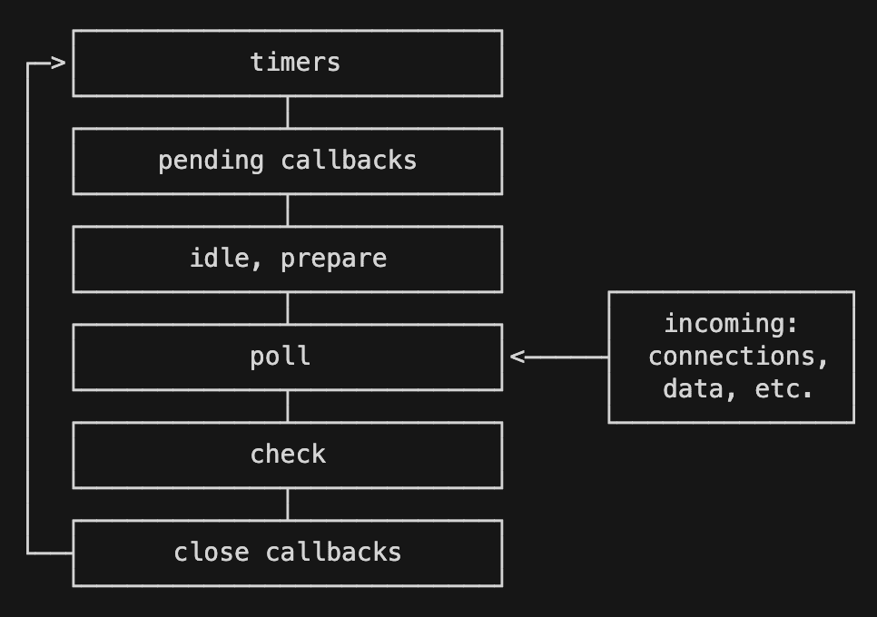

## Intro

Q. 어떠한 자바스크립트 코드가 HTTP 응답이나 사용자의 이벤트등에 종속되어 언제 실행되어야 할 지 알기 어려울 때엔 어떻게 해야 할까요?

A. HTTP응답은 네트워크의 속도와 request의 수신 및 처리, request에 대한 비즈니스 로직 및 서버 내 로직, 이에 대한 응답등으로 인해 언제 클라이언트의 요청에 대한 응답을 받을 수 있는지 알 수 없습니다.  

또한, 자바스크립트 코드가 사용자 이벤트에 종속되어 있는 경우에 클라이언트를 구축 할 때 이벤트 리스너 등을 통해 특정 이벤트에 그에 맞는 반응을 등록 합니다(콜백함수 등록).  
사용자가 그 이벤트를 점화 했을 때만 자바스크립트 코드들이 실행되기 때문에 그 시점에 대해 예측한다는 것은 거의 불가능 하다고 볼 수 있습니다.

### 1. callback

콜백함수는 다른 함수의 인자로 전달되는 함수입니다. 이 콜백함수는 외부 함수의 루틴 또는 행동이 완료되고 난 다음에 실행 / 호출됩니다. 자바스크립트 에서는 prompt, alert과 같은 동기 함수도 있으나, 수 많은 비동기 함수들이 존재합니다. 콜백은 주로 비동기 작업이 끝나고 나서 콜백 함수의 코드가 실행되어집니다.

네트워크 처리, 파일 읽기/ 쓰기 등을 비동기 함수로 처리 할 때 자바스크립트는 비동기 작업이 완료될 때 까지 기다리지 않고 나머지 코드를 먼저 실행합니다. 그러나 개발자가 비동기 작업이 완료 된 이후 처리해야 할 로직들이 존재하게 됩니다. 이를 해결하기 위한 방법으로써 콜백이 사용됩니다.

```javascript
$.get('url', function(response) {
  parseValue(response, function(id) {
    auth(id, function(result) {
      display(result, function(text) {
        console.log(text);
      });
    });
  });
});
```

## 1. Javascript Event Loop

자바스크립트의 경우 싱글 스레드 기반 언어이기 때문에 네트워크 관련 요청을 비동기적으로 처리하게 됩니다. 만약 동기적으로 처리한다면 즉시 처리되는 요청은 사용자에게 불편함을 주지 않으나, 어느 정도 시간이 걸리는 경우에는 클라이언트(브라우저)에서 네트워크 요청 처리하기 위해 다른 작업이 중단 될 것입니다.

그래서 브라우저 에서는 이런 비동기 작업들을 처리하기 위한 장치들로 이벤트 루프와 태스크 큐 등을 가지고 있습니다.

V8과 같은 자바스크립트 엔진은 단일 호출 스택(Call Stack)을 사용하며, 요청이 들어 올 때마다 해당 요청을 순차적으로 호출 스택에 담아 처리합니다.  
 단일 호출 스택만을 사용한다면, pop을 통해 호출 스택에 있는 요청을 처리하기 때문에 비동기 요청 및 동시성에 대한 처리는 불가능 해 집니다. 앞에 언급한 문제는 자바스크립트 엔진 구동 환경인 브라우저나 Node.js의 내부에서 처리합니다.


> * 비동기 호출을 위해 사용하는 setTimeOut이나 XMLHttpRequest 함수들은 JS Engine이 아닌 Web API 영역에 따로 저장되어 있습니다.  
> * 이벤트 루프나 태스크 큐와 같은 장치도 JS Engine 외부에 구현되어 있습니다.
> * 이벤트 루프는 자바스크립트 코드를 싱행하기 위해 자바스크립트 엔진을 이용합니다.
> * 자바 스크립트 엔진에는 이벤트 루프를 관리하는 코드가 없으며, Node.js나 브라우저가 이벤트 루프를 담당합니다.
> * 이벤트 루프는 task를 담아놓는 스택이 존재하지 않습니다. 그리고 이벤트 루프가 작동하는 과정은 여러 개의 큐를 사용하는 복잡한 과정입니다.
> * 자바스크립트 환경은 단일 스레드로 코드의 실행 및 이벤트 루프를 담당한다.

1. 메인 JS Thread는 network 요청, timer 함수, read & write 함수 등의 네이티브 비동기 API를 호출합니다.

2. 네이티드 비동기 API 호출 후, 브라우저 스레드 풀에 들어간다. 다시 메인 스레드로 제어가 반환하며 코드를 실행합니다.

3. 비동기 처리가 완료되면 태스크를 이벤트 큐에 추가합니다. 각 스레드가 자신의 큐를 가지고 있으며, 이를 이용해 비동기 연산 결과를 메인 스레드로 전달합니다. 태스크에는 호출 자체와 관련한 메타 정보 일부와, 메인 스레드와 연결된 콜백 함수의 참조가 들어가 있습니다.

4. 메인 스레드의 콜 스택이 비면 플랫폼은 이벤트 큐에 남아 있는 태스크가 있는지 확인합니다. 대기 중인 태스크가 있으면 플랫폼은 태스크를 실행합니다. 이때 함수 호출이 일어나며, 제어는 메인 스레드 함수로 반환됩니다.

5. 함수 호출이 끝나고 콜스택이 비면 플랫폼은 기다리는 태스크가 있는지 이벤트 큐에서 확인합니다.

6. 콜스택과 이벤트 큐가 모두 비고, 모든 비동기 네이티브 API 호출이 완료될 때 까지 이 과정을 반복합니다.

### 1) Run to completion

자바스크립트의 특징 중 하나는, **Run-to-Completion**입니다. 각 태스크는 다른 태스크가 완료된 후에 실행되거나, 명시적으로 스케쥴러에게 컨트롤을 반환하는 스케쥴링 모델을 의미합니다. 이는 OS에서 말하는 비선점 스케쥴링과 유사합니다. 이는, 자바스크립트 엔진은 하나의 호출 스택을 사용하며, 스택에 쌓여있는 모든 함수들이 실행을 마치고 스택에서 제거되기 전 까지 다른 어떤 함수도 실행 될 수 없음을 의미합니다.

여기서 핵심은, <u>자바스크립트가 싱글 스레드 기반의 언어</u> 라는 것은 `자바스크립트 엔진이 단일 호출 스택을 사용한다는 관점에서만 사실`이라는 것입니다. 실제 자바스크립트가 구동되는 환경(Node.js, Browser)의 경우 여러 개의 스레드가 사용되며, 구동 환경이 단일 호출 스택을 사용하는 JS 엔진과 상호 연동하기 위해 사용하는 장치가 Event Loop입니다.

### 2) Event loop

개발자가 `setTimeout`나 `XMLHttpRequest`, `fetch`등을 사용하여 비동기 요청을 처리하는 로직을 짰다고 가정해 봅시다. 여기서 자바스크립트를 해석하고 이를 실행할 때 순차적으로 콜스택에 담기게 되고, 실행됩니다. 실행된 함수 들 중 `setTimeout`, `XMLHttpRequest` 함수 같은 비동기 함수의 경우 브라우저에게 `타이머`, `AJAX 이벤트`를 요청한 후 바로 스택에서 제거 됩니다다.  

 이 때, 함수에 포함된 콜백 함수들은 즉시 사라지지 않고 **Task Queue**라는, 콜백 함수들이 대기하는 큐 형태의 배열에 들어가게 됩니다. 그리고 이벤트 루프는 호출 스택이 비워질 때마다 큐에서 콜백 함수를 꺼내와서 실행하는 역할을 합니다.

 ```javascript
 while(queue.waitForMessage()){
  queue.processNextMessage();
}
 ```

위 코드의 `waitForMessage()` 메소드는 현재 실행중인 태스크가 없을 때, 다음 태스크가 큐에 추가될 때 까지 대기하는 역할을 합니다. 이렇게 이벤트 루프는 현재 실행중인 태스크가 없는지 와 태스크 큐에 태스크가 있는지를 반복적으로 확인합니다. 이를 정리하자면

모든 비동기 API들은 작업이 완료되면 콜백 함수를 태스크 큐에 추가합니다.

이벤트 루프는 현재 실행중인 태스크가 없을 때(콜 스택이 비워졌을 때) 태스크 큐의 첫 번째 태스크를 꺼내와 실행합니다.

태스크 큐는 FIFO에 의해 동작되므로, 비동기 함수에서(Promise 등 micro task queue를 사용하는 것 제외) 우선적으로 동작하는 함수는 없습니다.

### 3) 이벤트 루프 작업 순서



이벤트 루프는 가능하다면 언제나 시스템 커널에 작업을 떠넘겨서 Node.js 또는 브라우저가 논 블로킹 I/O 작업을 수행하도록 해줍니다.

대부분의 현대 커널은 멀티 스레드이므로 백그라운드에서 다수의 작업을 실행할 수 있습니다. 이러한 작업 중 하나가 완료되면 커널이 Node.js 또는 브라우저에게 알려주어 적절한 콜백을 poll 큐에 추가할 수 있게 하여 결국 실행되게 합니다.

위 그림은 이벤트 큐의 구조입니다. 각 페이즈들은 실행할 callback의 FIFO 큐를 가지고 있습니다.

이벤트루프가 해당 단계에 진입하면 해당 단계에 한정된 작업을 수행하고 큐를 모두 소진하거나 콜백의 최대 개수를 실행할 때 까지 해당 단계의 큐에서 콜백을 실행합니다. 큐를 모두 소진하거나 콜백 제한에 이르게 되면 이벤트 루프는 다음 단계에 이동합니다.

 자바스크립트의 실행은 이 페이즈 들 중 `Idle`, `prepare`페이즈를 제외한 어느 단계에서나 일어날 수 있습니다.

`nextTickQueue`와 `microTaskQueue`는 이벤트 루프의 일부가 아니며, 이 큐들에 들어있는 작업 또한 어떤 페이즈에서든 실행 될 수 있으며, 이 큐 들에 있는 작업은 가장 높은 우선 실행 순위를 가지고 있다.

#### Timer phase

이벤트 루프의 시작을 알리는 페이즈.

이 페이즈가 가지고 있는 큐에서는 **setTimeout**이나 **setInterval**로 스케줄링한 콜백을 실행합니다.
이 페이즈에서 타이머들의 콜백이 큐에 들어가는 것은 아니나, 타이머들을 min-heap으로 가지고 있다가 실행 할 때가 된 타이머들의 콜백을 태스크 큐에 넣고 실행합니다.

타이머는 사람이 실행하기를 원하는 정확한 시간이 아니라 제공된 콜백이 일정 시간 후에 실행되어야 하는 기준시간을 지정합니다.  

타이머 콜백은 지정한 시간이 지난 후에 스케줄링 될 수 있는 가장 이른 시간에 실행될 것입니다. 하지만 운영체제 스케줄링이나 다른 콜백 실행 때문에 지연될 수 있습니다.

#### Pending i/o callback phase

이벤트 루프의 pending_queue에 들어있는 콜백들을 실행합니다.

이 queue에 들어와있는 콜백들은 현재 돌고 있는 루프(이벤트 루프) 이전에 한 작업에서 이미 큐에 들어와있던 콜백들(에러 핸들러 callback 및 fileWrite 등) 입니다.

#### Idle, Prepare phase

Idle phase는 매 Tick 마다 실행되며 Prepare phase는 매 Polling마다 실행됩니다. 내부용으로만 사용 됩니다.

#### Poll phase

새로운 I/O 이벤트를 가져옵니다.

Poll 단계는 두 가지 주요한 기능을 가집니다.

1. I/O를 얼마나 오래 블록하고 폴링해야 하는지 계산합니다.
2. 그 다음 poll 큐에 있는 이벤트를 처리합니다.

이벤트 루프가 poll 단계에 진입하고 스케줄링된 타이머가 없을 때 두 가지 중 하나의 상황이 발생합니다.

* watch_queue(Poll phase가 가지고 있는 queue)가 비어있지 않다면, event loop가 콜백 큐를 순회하며 queue가 비거나, 시스템 최대 실행 한도에 다다를 때 까지 I/O와 연관된 콜백을 실행합니다.

* watch_queue가 비어있다면, 다음 중 하나의 상황이 발생합니다.
  * 스크립트가 setImmediate()로 스케줄링되었다면 이벤트 루프는 poll 단계를 종료하고 스케줄링된 스크립트를 실행하기 위해 check 단계로 넘어갑니다.

  * 스크립트가 setImmediate()로 스케줄링되지 않았다면 이벤트 루프는 콜백이 큐에 추가되기를 기다린 후 즉시 실행합니다.

poll 큐가 일단 비게 되면 타이머가 시간 임계점에 도달했는지 확인할 것입니다. 하나 이상의 타이머가 준비되었다면 이벤트 루프는 타이머의 콜백을 실행하기 위해 timers 단계로 돌아갈 것입니다.

#### Check phase

poll 단계가 완료된 직후 사람이 콜백을 실행할 수 있게 합니다. poll 단계가 유휴상태가 되고 스크립트가 `setImmediate`로 큐에 추가 된 경우 이벤트 루프를 기다리지 않고 check 단계를 진행합니다.

#### Close phase

close이벤트 타입의 핸들러들을 처리합니다.

#### nextTickQueue & microTaskQueue

nextTickQueue는 process.nextTick() API의 콜백들을 가지고 있습니다.

microTaskQueue는 Resolve된 promise의 콜백을 가지고 있습니다.

## 2. Callback

비동기 JS의 기본 단위는 callback 이다. 다른 함수의 인수 형태로 함수가 전달되며, 동기 프로그램처럼 특정 함수가 고유한 동작을 완료하면, 호출자가 건넨 콜백 함수를 호출한다.

> 비동기 코드가 호출하는 콜백은 보통의 함수라서 비동기로 호출됨을 알리는 전용 타입 시그니처는 존재하지 않는다.

## 3. Promise

```tsx
function appendNReadPromise(path: string, data: string): Promise<string> {
  return appendPromise(path, data)
    .then(() => readPromise(path))
    .catch(console.error)
}
```